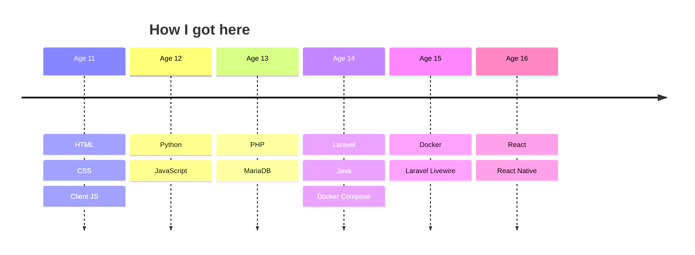

## Hey there! 👋

### Welcome to My GitHub Profile

I'm **Jim**, a passionate developer working on cool projects and always exploring new things.

> My portfolio is [here](https://jimster.dev) (wip)

### 🛠️ What I Do
- 🌐 **Founder & Developer** at [TallDwarf Hosting](https://talldwarf.host/a/Jim)
- 🛠️ **Building:** [Pumpkin Market](#) – Marketplace for PumpkinMC plugins
- 📜 **Experimenting with:** automation, AI integrations, and optimisation.

### 💡 Skills & Technologies
#### 💻 Languages and Frameworks

- 🔧 **Tools & Frameworks:** Docker, Laravel, Node.js, React, React Native
- 🎮 **Game Dev & Hosting:** Pterodactyl hosting setups, custom Minecraft plugins

### 🚀 What I'm Currently Up To
- **Expanding Pumpkin Market** — GitHub account and repo linking, binary uploads and security
- **Hosting & Infrastructure** — working on efficient self-hosted solutions
- **Making Fun Stuff** — all the time
- **Automation** — Working with AI, creating LLMs and seeing what I can tweak

### 📫 Get in Touch
- 💬 Discord: `jimster.dev`
- 🌐 [TallDwarf Hosting](https://talldwarf.host/a/Jim)

---

<!---  -->

<!--- ^^ Theres probably stuff I missed out, going to look back and check :) -->

> ⚡ Fun Fact: The first mac & cheese recipe was written in a **13th-century** Italian cookbook called *Liber de Coquina!*
